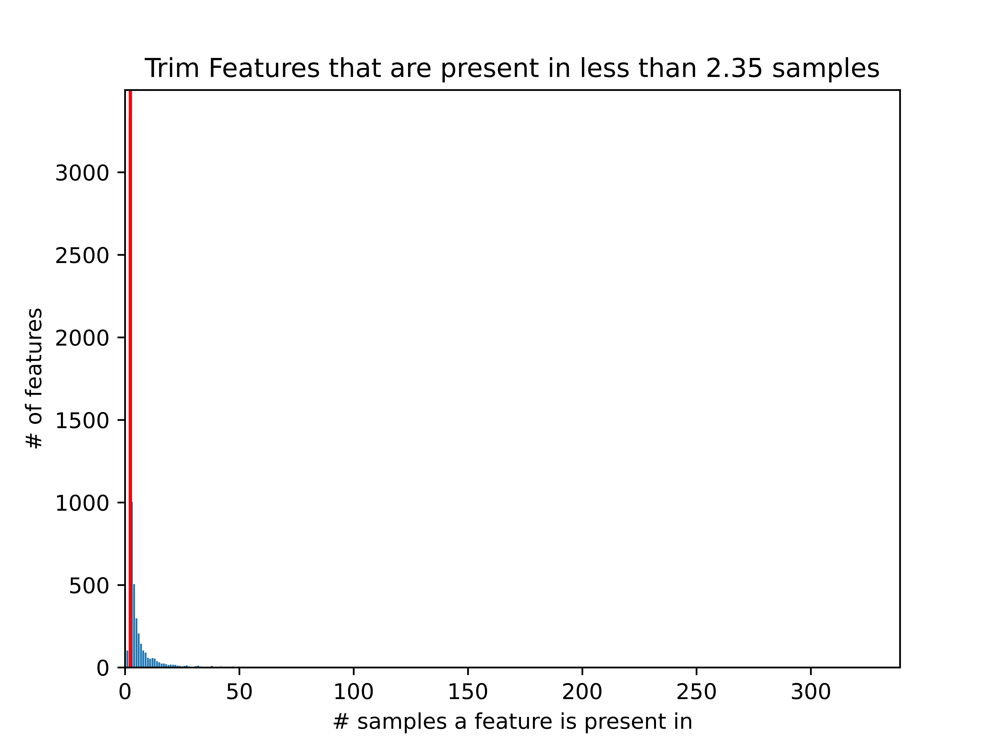

# curvcut: README: Post-Qiime2 auto remove features/speices
### Adrian Ortiz-Velez


This project was created to proved a mathematical backing to eliminating sparse features in a count tables. 
Input: OTU table tsv or SFS data
Output: Zero filtered table ready for downstream analysis

In this directory 
```
.
├── data
│   ├── alexdata
│   │   ├── feature-table.biom
│   │   └── table.from_biom.tsv
│   ├── building_data
│   │   ├── 16S_OTU_Table_building_materials.tsv
│   │   └── 16S_OTU_Table_building_materials.txt
│   ├── kaelyn_data
│   │   ├── 16Sfeattable.tsv
│   │   ├── clean_16S.tsv
│   │   └── clean_its.tsv
│   ├── minor_allele_data
│   │   ├── hiv_pol.fasta
│   │   └── sfs-output.csv
│   └── periodontal_data
│       ├── 2020-09-18_PT_16S_OTU_Tabl.csv
│       ├── 2020-09-18_PT_cyto_table.csv
│       ├── 2020-09-18_PT_metagen_table.csv
│       ├── 2020-09-20_16S_SHT_OTU_Tabl.csv
│       ├── 2020-09-20_SHT_metab_table.csv
│       └── 2020-09-20_SHT_metagen_table.csv
├── README.md
└── scripts
    └── 2023-01-04_calccutoff.py

```

Dependincies:
 * Pandas 1.3.3
 * Numpy 1.19.2
 * Matplotlib 3.3.4
 * SciPy 1.7.1


To download 

```bash
$ gh repo clone aortizsax/curvcut
```

```bash
$ cd curvcut
```

```bash
$ conda create -n curvcut python=3.9 scipy=1.7.1 matplotlib=3.3.4 numpy=1.19.2 pandas=1.3.3
```

To run in commandline, add script to path. Usage below.

```bash
$ python3 2023-01-04_calccutoff.py [-h] [-ct FILE] [-af FILE] [-o OUTPUT_PREFIX]
                                [-u USER_CUTOFF]

optional arguments:
  -h, --help            show this help message and exit
  -ct FILE, --counttable FILE
                        Path to source file.
  -af FILE, --minorallelefreq FILE
                        Path to source file.
  -o OUTPUT_PREFIX, --output-prefix OUTPUT_PREFIX
                        Prefix for output files [default=output].
  -u USER_CUTOFF, --user-cutoff USER_CUTOFF
                        Prefix for output files [default=-1].
```

Example:

	cd ./data/building_data/
	python3 2023_01-04_calccutoff.py -ct 16S_OTU_Table_building_materials.tsv
	
Output:
* Try including './' in front of the data (./16S_OTU_Table_building_materials.tsv) if it returns a permissions error
* Makes a new directory in the same as the input table
* Saves graphs of finding the max curvature
* Saves saves visual for user diagnosis
* Saves zero filtered table in the new directory
* Outputs code below for example
```
Cubic Spline Finshed
Execution time in seconds: 1.1464474201202393
Recommended  Cutoff: Trim Features that are present in less than 2.35 samples

Zero Filtered OTU table saved: ./output/16S_OTU_Table_building_materialstable.zerofiltered.csv
```
<>
